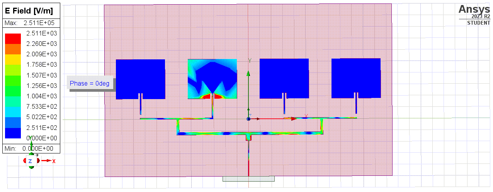
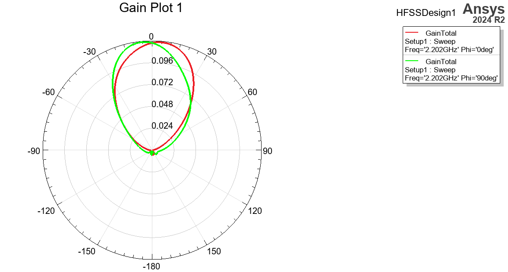
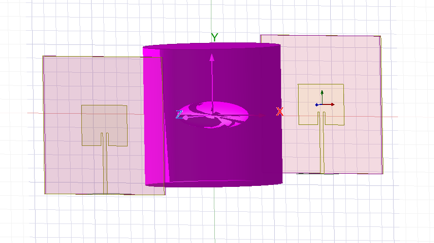

# Microwave Bone Crack Detection

## 1. Project Overview

This project involves switched microstrip patch antenna array design ay **2.4GHz** on a flexible polyimide substrated for the purpose of scanning bones for defects using **Ansys HFSS**.

The main parameters analyzed are **S11, S12 resonant frequency, and electric field distribution**.

---

## 2. Objectives

* Design an antenna array on a flexible substrate.
* Model bone and bone-crack structures.
* Simulate antenna interaction with the bone model.
* Compare intact and cracked bone responses.
* Determine the optimal distance from skin required to detect the crack effectively.
* Analyze changes in S11 and resonant frequency.

---

## 3. Software

* Ansys Electronics Desktop
* Python

---

## 4. Project Structure

```text
Microwave_Imaging/
├── HFSS/
│   ├── Attempted_8x1_Array.aedt
│   ├── BoneCrackTwoAntennaTest.aedt
│   ├── DistanceOpti.aedt
│   ├── DP_1810_3_1.aedt
│   ├── DualAntennaSetup.aedt
│   ├── Failed_4x1_Array
│   ├── FR4_Antenna.aedt
│   ├── limbmodel.aedt
│   ├── MP2.4.aedt
│   ├── MultiAntennaCrack.aedt
│   ├── MultiAntennaDistance.aedt
│   ├── SingleAntenna_All_Solids
│   └── Working_4x1_array.aedt
│
├── images/
│   ├── FOURANTENNA.gif
│   ├── Frequency difference thin.png
│   └── Magnitude difference thin.png
│
├── python/
│   └── Analyze.py
│
├── results/
│   ├── S11.csv
│   ├── S21.csv
│   ├── SingleAntennaCrackDistfromLimb.csv
│   └── SingleAntennaDistfromLimb.csv
│
├── LICENSE
└── README.md
```


---

## 5. Iterative Antenna Design

### Microstrip Patch Antenna

* **Operating Frequency:** `2.4GHz`
* **Substrate:** `Polyimide`
* **Substrate Thickness:** `25um`
* **Dimensions:** `l*w(mm) = 34.4*42.6`
* **Feed Type:** `Microstrip Line`
* **File Name** `SingleAntenna_All_Solids.aedt`

**Purpose:**

`This was an initital design for a single flexible antenna. The simulation for this involved modelling the copper as a solid, as it was initially assumed that the thin substrate would require solid copper rather than sheets. Later it was discovered that this wasn't needed.`

---

### 4x1 Microstrip Patch Antenna Array

* **Operating Frequency:** `2.4GHz`
* **Substrate:** `Polyimide`
* **Substrate Thickness:** `25um`
* **Dimensions:** `l*w(mm) = 34.4*42.6`
* **Feed Type:** `Switchable corporate feed`
* **File Name** `Working_4x1_array.aedt`

**Purpose:**

`This design was used to expand the single element and create a wrappable array. The angle of scanning can be adjusted by using RF switches. The proposed switch was HMC1055. The figure shows the array with one antenna ON.`

#### E Field with the second antenna ON



### Radiation pattern in the same configuration



---

### FR4 dual rotated antennas

* **Operating Frequency:** `2.4GHz`
* **Substrate:** `FR4`
* **Substrate Thickness:** `1.6mm`
* **Dimensions:** `l*w(mm) = 29.4*38`
* **Feed Type:** `Microstrip Line`
* **File Name** `FR4_Antenna.aedt`

**Purpose:**

`As the design of the 8x1 array failed due to failing matching for the switches, due to time constraints the actually implemented design in hardware were two rotating FR4 antennas pointed at the bone opposed to each other. S11 and S12 parameters were collected from 1.2 to 3.6 GHz for each angle at a resolution of 30 degrees. The results are in the files S11 and S21.csv. At the angles closest to the crack, there was a difference between the intact bone and the bone with a crack in the S11 and S21 parameters.`

#### Antenna Setup




---

## 6. Bone Model

For the FR4 antennas, an optimal distance between the bone and antennas for detection was investigated by using a bone model in Ansys HFSS. A crack was also incorporated into the model to compare with the intact model and optimize for detection distance.

### Material Properties

| Material | Relative Permittivity | Conductivity |
| -------- | --------------------: | -----------: |
| Bone     |                `11.4` |      `0.788` |
| Muscle   |                `52.8` |       `1.71` |
| Skin     |                `38.1` |       `1.44` |
| Air      |                   `1` |          `0` |

---

## 7. Crack Model

The crack is modeled as an ellipsoid discontinuity (air gap) inside the bone structure.

| Parameter         |           Value |
| ----------------- | --------------: |
| Crack Length      |          `4 mm` |
| Crack Width       |          `1 mm` |
| Crack Depth       |          `1 mm` |
| Crack Location    |        `Center` |

---

## 8. HFSS Simulation Setup

### Solution Setup

* **Solution Frequency:** `2.4GHz`
* **Frequency Sweep:** `1.2 - 3.6 GHz`
* **Sweep Type:** `Fast (Linear)`
* **Maximum Passes:** `6`
* **Maximum Delta S:** `0.02`

### Excitation

* **Port Type:** `Wave Port`
* **Number of Ports:** `1-2`
* **Port Impedance:** `Zpi (matched with 50)`

### Boundary Conditions

* **Radiation Boundary:** `Yes`
* **PML:** `No`
* **Other:** `Infinite Sphere for radiation patterns`

---

## 10. Results

### S11 Comparison


### Resonant Frequency


### Hardware Comparison

The hardware results also showed a frequency shift in resonance that was not visible in the simulation.

### Result files

The simulation result files are `S11.csv` and `S21.csv` where only the first port was excited. The csv files `results/SingleAntennaCrackDistfromLimb.csv` and `results/SingleAntennaCrackDistfromLimb.csv` were used to generate the above graphs and find an optimal distance from the limb.

---

## 11. Future Work

* Use inverse scattering algorithms for imaging.
* Match the switches using various approaches for 8x1 array.
* Hardware implementation on flexible substrate
* Research phased arrays as an alternative to RF switches.
---

## 12. References

1. Ansys HFSS Documentation
2. Microwave Engineering - David M. Pozar
3. [Tissue permittivity reference](https://itis.swiss/virtual-population/tissue-properties/database/dielectric-properties)
4. [Calculator for patch antennas](https://www.emtalk.com/mpacalc.php)
5. Kwon S, Lee S. Recent Advances in Microwave Imaging for Breast Cancer Detection. Int J Biomed Imaging. 2016;2016:5054912. doi: 10.1155/2016/5054912. Epub 2016 Dec 21. Erratum in: Int J Biomed Imaging. 2018 May 2;2018:1657073. doi: 10.1155/2018/1657073. PMID: 28096808; PMCID: PMC5210177.
6. Ruvio G, Cuccaro A, Solimene R, Brancaccio A, Basile B, Ammann MJ. Microwave bone imaging: a preliminary scanning system for proof-of-concept. Healthc Technol Lett. 2016 Jun 30;3(3):218-221. doi: 10.1049/htl.2016.0003. PMID: 27733930; PMCID: PMC5047277.

---
